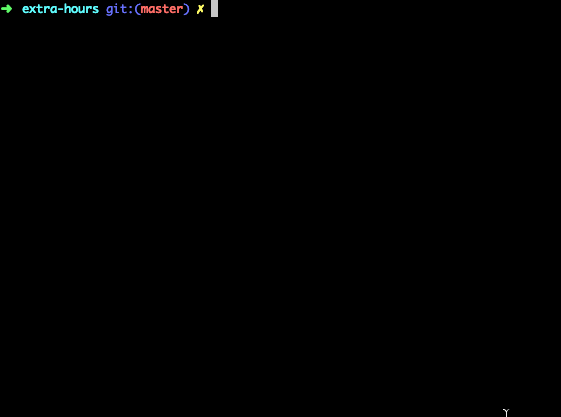

# Extra hours

Generate a report of the extra hours that you've worked, sliced by weekday, weekend and including night hours.

## How To

Run `node .`, fill the field and have your data sliced!

  

## Features

* Weekday, weekend and nighly: slices the hours that you've worked by weekday, weekend and nighly.
* Customizable date range to search for the extra hours.
* See the total hours worked per project or all the projects.
* COMING SOON: Zoho integration!

## Design

* Zero dependencies: no `package.json` or `node_modules` to bother with.
* Integrated test runner: run `node test` to run this project's suite.
* Module-based: the application's main functionalities are divided into reusable modules in the `lib` folder.
